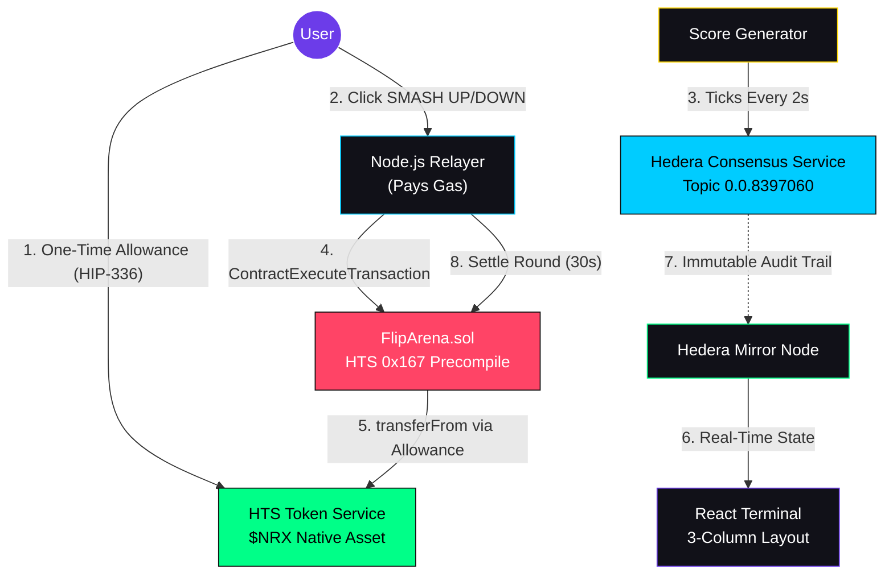

<div align="center">

# NARRIX ($NRX)

### The 30-Second Pulse: Frictionless High-Frequency Prediction Markets on Hedera

[](https://hashscan.io/testnet)
[](https://react.dev)
[](https://nodejs.org)
[](https://www.prisma.io)
[](https://socket.io)

**[Live Demo Video](#)** | **[HashScan Contract](https://hashscan.io/testnet/contract/0.0.8397048)** | **[HCS Oracle Topic](https://hashscan.io/testnet/topic/0.0.8397060)**

</div>

---

## The Problem

Most Web3 games are **slow and frustrating**. Every action triggers a wallet popup. RPC calls add seconds of latency. Users abandon the experience before the fun starts.

Prediction markets amplify this pain. A 30-second game round cannot survive a 5-second MetaMask confirmation on every bet.

## The Solution

Narrix uses two Hedera-native innovations to deliver **zero-popup, sub-second gameplay**:

1. **HIP-336 Silent Signing** --- Users approve a one-time token allowance. Every subsequent bet is executed by a backend relayer with zero wallet interaction.
2. **HCS Price Oracle** --- A decentralized price feed streamed every 2 seconds via Hedera Consensus Service --- no off-chain oracle latency, full on-chain audit trail.

The result: **5 rapid-fire bets in 15 seconds**, zero popups, sub-cent fees, and every action verifiable on HashScan.

---

## Technical Architecture



### How a Round Works

```
T=0   Round starts. Oracle snapshots the score.
      Users click SMASH UP or SMASH DOWN (silent fetch, no wallet popup).
      Relayer calls FlipArena.deposit() --- contract pulls NRX via HIP-336 allowance.

T=30  Settlement. Relayer compares score now vs. score at T=0.
      Calls FlipArena.settleRound() --- winners split the entire pot proportionally.
      Socket.io broadcasts results. Confetti flies. Balance animates. Repeat.
```

---

## Hedera Power-User Highlights

### HIP-336: Account Allowances (Silent Signing)

The user signs **once** to approve the FlipArena contract as a spender via `AccountAllowanceApproveTransaction`. From that point forward, the relayer executes `IERC20.transferFrom()` inside the smart contract to pull funds --- **zero wallet popups per bet**.

This is the core UX innovation. Traditional dApps require a signature on every state-changing action. Narrix requires one.

### HTS Native Assets ($NRX)

`$NRX` is a **native Hedera Token Service asset**, not an ERC-20 deployed via Solidity. This means:
- Sub-cent transfer fees (vs. $0.50+ on EVM L1s)
- Native token association model (explicit opt-in)
- Accessible via the `0x167` HTS precompile inside smart contracts

### HCS-Based Oracle (Topic [`0.0.8397060`](https://hashscan.io/testnet/topic/0.0.8397060))

Every 2 seconds, the backend publishes a JSON payload `{ score, timestamp }` to an HCS topic. This creates an **immutable, timestamped, consensus-ordered audit trail** of the game's data source --- verifiable by anyone on HashScan.

No Chainlink. No off-chain API. Pure Hedera infrastructure.

### Mirror Node State Management

Instead of RPC-polling contract state (slow, rate-limited), the frontend queries **Hedera Mirror Node REST APIs** directly:
- Token balances: `/api/v1/accounts/{id}/tokens`
- Allowance verification: `/api/v1/accounts/{id}/allowances/tokens`
- Transaction history: `/api/v1/topics/{id}/messages`

This eliminates the JSON-RPC relay bottleneck entirely.

---

## On-Chain Deployment

All contracts and assets are live on **Hedera Testnet**. Click to verify on HashScan:

| Asset | ID | HashScan |
|-------|-----|----------|
| **FlipArena Contract** | `0.0.8397048` | [View Contract](https://hashscan.io/testnet/contract/0.0.8397048) |
| **$NRX Token** | `0.0.8397034` | [View Token](https://hashscan.io/testnet/token/0.0.8397034) |
| **HCS Oracle Topic** | `0.0.8397060` | [View Topic](https://hashscan.io/testnet/topic/0.0.8397060) |
| **Operator Account** | `0.0.8394615` | [View Account](https://hashscan.io/testnet/account/0.0.8394615) |

---

## The Terminal UI

Three-column "Degen Terminal" layout designed for flow state:

```
┌─────────────┬──────────────────────────────┬──────────────┐
│  HYPE FEED  │          THE ARENA           │   COMMAND    │
│             │                              │   CENTER     │
│  Live bets  │  R3 ████████░░ 18   5432 +142│              │
│  stream in  │  ┌──────────────────────┐    │  Balance     │
│  real-time  │  │   TradingView Chart  │    │  1,000 NRX   │
│  via Socket │  │   + Entry Price Line │    │  [GET NRX]   │
│             │  └──────────────────────┘    │              │
│  ─── or ─── │  ┌── UP ──┬── DOWN ──┐      │  [100] [500] │
│  TOP 10     │  │ 300    │  150     │      │  [1K]  [5K]  │
│  Leaderboard│  └────────┴──────────┘      │              │
│             │  My History (+ HashScan txns)│  [SMASH UP ] │
│             │                              │  [SMASH DOWN]│
└─────────────┴──────────────────────────────┴──────────────┘
```

---

## Quick Start

### Prerequisites
- Node.js 18+
- [HashPack Wallet](https://www.hashpack.app/) (browser extension, set to Testnet)
- [WalletConnect Project ID](https://cloud.walletconnect.com/) (free)

### 1. Clone & Install

```bash
git clone https://github.com/Narrix-App/Core-app.git
cd Core-app
cd backend && npm install && cd ../contracts && npm install && cd ../frontend && npm install --legacy-peer-deps && cd ..
```

### 2. Deploy to Hedera Testnet

```bash
# Create your .env in backend/ with your Hedera Testnet credentials:
# OPERATOR_ID=0.0.XXXXX
# OPERATOR_KEY=<DER-encoded-private-key>
# WC_PROJECT_ID=<your-walletconnect-project-id>

cd backend && node create-nrx.js                 # Mint $NRX token
cd ../contracts && npx hardhat compile && node scripts/deploy.mjs   # Deploy FlipArena
cd ../backend && node setup-arena.js              # Approve HIP-336 allowance
```

### 3. Run

```bash
# Terminal 1 — Backend (Relayer + Oracle + Socket.io)
cd backend && node server.js

# Terminal 2 — Frontend (Vite + React)
cd frontend && npm run dev
```

### 4. Play

Open **http://localhost:5173** --- Connect HashPack --- Set Up Account --- SMASH.

---

## Tech Stack

| Layer | Technology | Purpose |
|-------|-----------|---------|
| **Smart Contract** | Solidity 0.8.20 + HTS 0x167 Precompile | On-chain pool custody & proportional settlement |
| **Backend** | Node.js + Express + Socket.io | Relayer, HCS oracle, settlement loop |
| **Database** | SQLite + Prisma | Bet indexing, leaderboard, user history |
| **Frontend** | React + Vite + Tailwind CSS | 3-column terminal UI |
| **Charts** | TradingView Lightweight Charts | Real-time streaming pulse chart |
| **Animations** | Framer Motion + Canvas Confetti | Feed slide-in, win/lose dopamine effects |
| **Wallet** | HashConnect v3 (WalletConnect) | One-time pairing + transaction signing |
| **Oracle** | Hedera Consensus Service (HCS) | 2-second price ticks with immutable audit trail |
| **State Reads** | Hedera Mirror Node REST API | Zero-RPC balance, allowance, and history queries |

---

## Project Structure

```
Core-app/
├── backend/
│   ├── server.js           # Express + Socket.io + Oracle + Settlement
│   ├── create-nrx.js       # $NRX token minting script
│   ├── setup-arena.js      # HIP-336 allowance approval
│   └── prisma/             # SQLite schema + migrations
├── contracts/
│   ├── contracts/
│   │   ├── FlipArena.sol   # Core prediction market contract
│   │   └── MockNRX.sol     # Test ERC-20 for Hardhat tests
│   ├── test/
│   │   └── FlipArena.test.js  # 12 unit tests (100% math verification)
│   └── scripts/
│       └── deploy.mjs      # Hedera SDK deployment
└── frontend/
    └── src/
        ├── App.jsx                    # 3-column terminal layout
        ├── components/
        │   ├── PulseChart.jsx         # TradingView chart + entry line
        │   ├── TimerBar.jsx           # 30s countdown
        │   ├── HistoryTable.jsx       # User bets + HashScan links
        │   ├── HypeFeed.jsx           # Live global feed + leaderboard
        │   └── CommandCenter.jsx      # Wallet, balance, bet buttons
        ├── context/WalletContext.jsx   # HashConnect provider
        └── hooks/                     # useSocket, useGameState, useBalance
```

---

## Smart Contract Tests

```bash
cd contracts && npx hardhat test
```

```
  FlipArena
    ✔ should accept deposits and track pools correctly
    ✔ should settle UP correctly with proportional payouts
    ✔ should settle DOWN correctly
    ✔ should handle single-sided UP pool
    ✔ should keep funds in contract when no winners
    ✔ should settle empty rounds without reverting
    ✔ should reject deposits from non-relayer
    ✔ should reject settleRound from non-relayer
    ✔ should reject invalid direction
    ✔ should reject zero-amount deposits
    ✔ should increment round number on each settlement
    ✔ should handle large asymmetric pools without precision loss

  12 passing
```

---

## License

Apache-2.0
